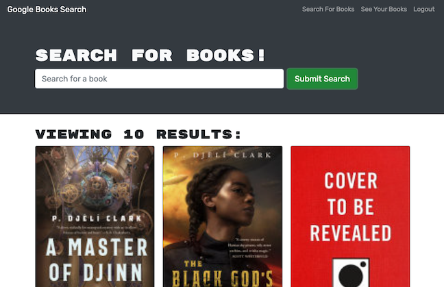

# Book Worm

  

  ## Description

  Book Worm is an application that allows users to search for and save books using the google books API. 

  

  ## Table of Contents

  * [Installation](#installation)
  * [Deployed App](#deployed_app)
  * [License](#license)
  * [Questions](#questions)
  
  ## Installation

  Follow these steps for installing this project:

  To see the code for yourself, clone the repository to your machine. From the root of the application run the command `npm i` to install the necessary dependencies. Repeat this process for the `client` and `server` folders to ensure all packages are installed. From the root of the app you can use the command `npm run develop` to load both front and back-end.

  ## Deployed App

  To see this app for yourself, click [here](https://dry-cliffs-60942.herokuapp.com/).

  ## License

  This project is licensed with Boost Software License 1.0. Click the license icon at the top of this README for the full license information.

  ## Questions

  If you have questions about this project please contact me at [crawleyj2@gmail.com](mailto:crawleyj2@gmail.com).
  More of my work can be found on GitHub at [crawleyj2](https://github.com/crawleyj2)

